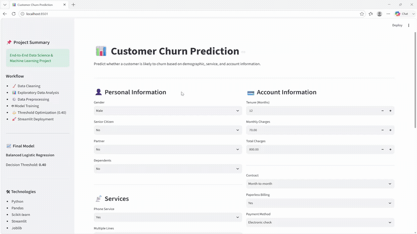
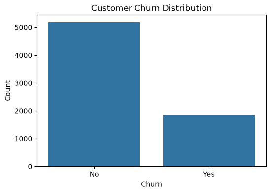
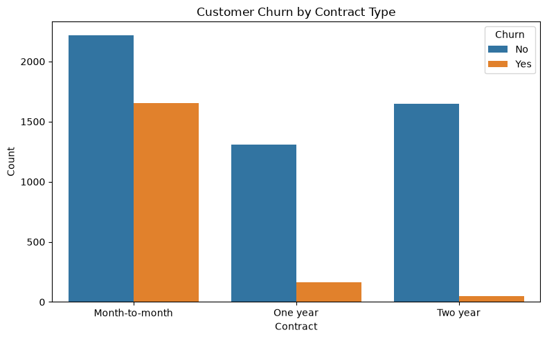
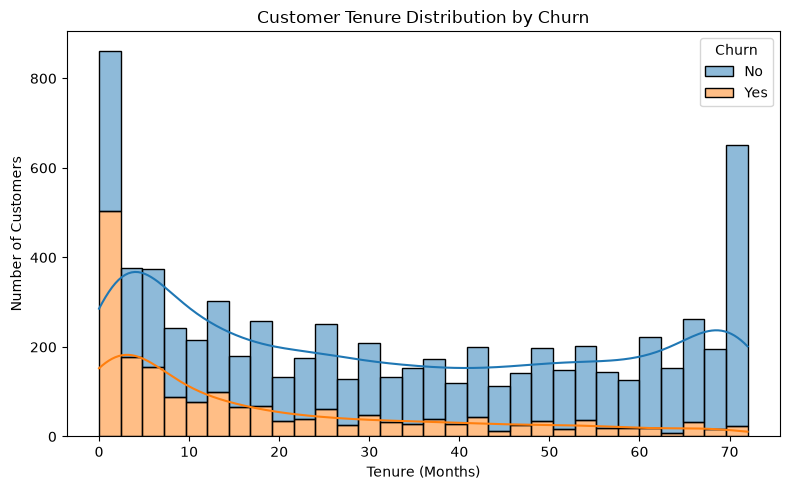
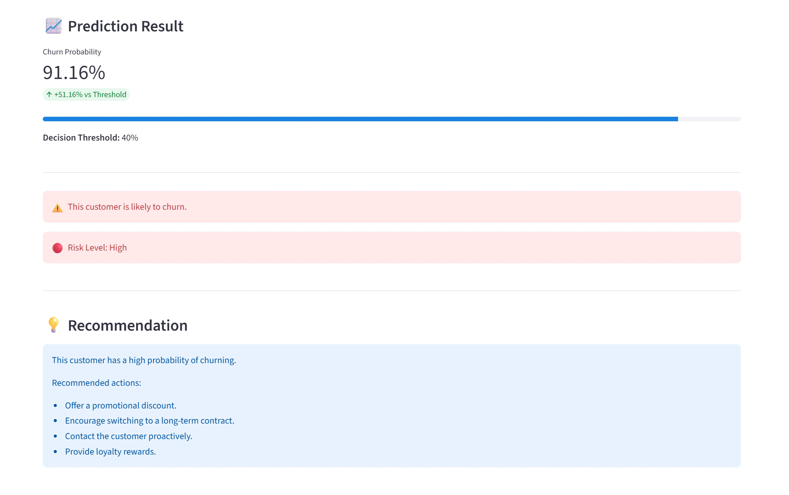
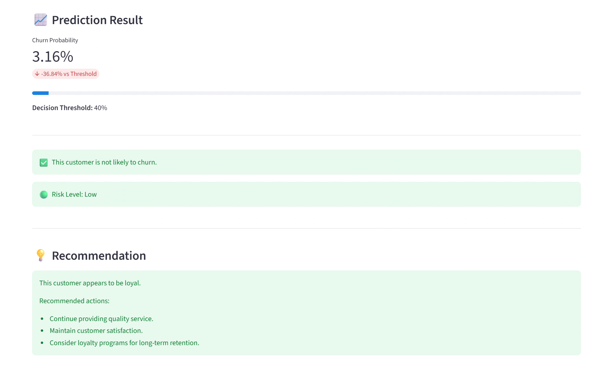

# 📊 Customer Churn Prediction


## 🎬 Demo

<p align="center">
  
</p>

An end-to-end **Data Science and Machine Learning** project that predicts whether a telecommunications customer is likely to churn using a **Balanced Logistic Regression** model.

The project covers the complete workflow from **data exploration and preprocessing** to **model training, evaluation, threshold optimization, and deployment** through an interactive **Streamlit** web application.
 
---

## 🚀 Live Demo

Try the deployed application here:

🌐 **Streamlit App:**  
https://customer-churn-prediction-ahmed-alquwaie.streamlit.app/

---

# 📑 Table of Contents

- [Project Overview](#-project-overview)
- [Business Problem](#-business-problem)
- [Dataset](#-dataset)
- [Features](#-features)
- [Installation](#%EF%B8%8F-installation)
- [Methodology](#%EF%B8%8F-methodology)
- [Exploratory Data Analysis](#-exploratory-data-analysis)
- [Data Preprocessing](#%EF%B8%8F-data-preprocessing)
- [Model Training](#-model-training)
- [Threshold Optimization](#-threshold-optimization)
- [Model Comparison](#-model-comparison)
- [Final Model Selection](#-final-model-selection)
- [Streamlit Application](#-streamlit-application)
- [Screenshots](#-screenshots)
- [Demo Video](#-demo-video)
- [Project Structure](#-project-structure)
- [Technologies Used](#%EF%B8%8F-technologies-used)
- [Results](#-results)
- [Limitations](#%EF%B8%8F-limitations)
- [Future Improvements](#-future-improvements)
- [Author](#%E2%80%8D-author)

---

# 📌 Project Overview

This project aims to predict **customer churn** for a telecommunications company using supervised machine learning techniques.

Customer churn prediction helps businesses identify customers who are likely to leave the service, enabling proactive retention strategies such as personalized offers, loyalty programs, or customer support.

The project follows a complete **End-to-End Data Science workflow**, including:

- Data Cleaning
- Exploratory Data Analysis (EDA)
- Data Preprocessing
- Feature Engineering
- Machine Learning Model Training
- Model Evaluation
- Threshold Optimization
- Model Comparison
- Streamlit Deployment

---

# 💼 Business Problem

Customer churn is one of the biggest challenges faced by subscription-based businesses such as telecommunications companies.

Acquiring a new customer is often significantly more expensive than retaining an existing one. Therefore, identifying customers who are likely to churn enables companies to take proactive actions before losing them.

The objective of this project is to build a machine learning model that predicts customer churn based on customer personal information, subscribed services, and account details.

The final solution is deployed as an interactive **Streamlit** application that allows users to predict churn probability in real time.

---

# 📂 Dataset

The project uses the **Telco Customer Churn Dataset**, which contains customer personal information, subscribed services, account details, and churn labels.

### Dataset Summary

- **Number of Customers:** 7,043
- **Input Features:** 19
- **Target Variable:** Churn (Yes / No)

### Feature Categories

- 👤 Personal Information
- 📡 Services
- 💳 Account Information

---

# ✨ Features

The model uses the following customer attributes:

### 👤 Personal Information

- Gender
- Senior Citizen
- Partner
- Dependents

### 📡 Services

- Phone Service
- Multiple Lines
- Internet Service
- Online Security
- Online Backup
- Device Protection
- Tech Support
- Streaming TV
- Streaming Movies

### 💳 Account Information

- Tenure
- Contract
- Paperless Billing
- Payment Method
- Monthly Charges
- Total Charges

---

# ⚙️ Installation

> **Note:** If you only want to use the application, you can access the deployed Streamlit app directly (see the Live Demo section above). The following steps are only required if you want to run the project locally.

## 1. Clone the repository

If Git is not installed on your system, you can either:

- Install Git from https://git-scm.com/downloads
- Or download the repository as a ZIP file using **Code → Download ZIP**.

Then clone the repository:

```bash
git clone https://github.com/Ahmed-Alquwaie/customer-churn-prediction.git

cd customer-churn-prediction
```

> **Important:** Make sure all subsequent commands are executed from inside the project directory.

---

## 2. Create a virtual environment

```bash
python -m venv venv
```

---

## 3. Activate the virtual environment

### Windows

```bash
venv\Scripts\activate
```

> **If you're using Windows PowerShell and the activation command doesn't work, try:**

```powershell
.\venv\Scripts\Activate.ps1
```

> **If activation is successful, your terminal prompt should begin with `(venv)`.**

### Linux / macOS

```bash
source venv/bin/activate
```

---

## 4. Install project dependencies

```bash
pip install -r requirements.txt
```

---

## 5. Run the Streamlit application

```bash
streamlit run app.py
```

After running the command, Streamlit will automatically open the application in your default web browser.

If it does not open automatically, open the URL displayed in the terminal (typically):

```text
http://localhost:8501
```

---

## 6. Start predicting customer churn

Use the interactive web interface to:

- Enter customer information.
- Predict churn probability.
- View the customer risk level.
- Receive business recommendations.

---

# ⚙️ Methodology

The project follows a complete end-to-end Data Science workflow:

```text
                                  Dataset
                                     │
                                     ▼
                               Data Cleaning
                                     │
                                     ▼
                       Exploratory Data Analysis (EDA)
                                     │
                                     ▼
                            Data Preprocessing
                                     │
                                     ▼
                            Feature Engineering
                                     │
                                     ▼
                              Model Training
                                     │
                                     ▼
                             Model Evaluation
                                     │
                                     ▼
                           Threshold Optimization
                                     │
                                     ▼
                           Final Model Selection
                                     │
                                     ▼
                          Streamlit Web Application
```

### Workflow Summary

1. Cleaned and prepared the raw dataset.
2. Performed exploratory data analysis to understand customer behavior.
3. Preprocessed categorical and numerical features.
4. Built a machine learning pipeline for preprocessing and classification.
5. Trained and evaluated multiple machine learning models.
6. Optimized the decision threshold to improve churn detection.
7. Selected the best-performing model.
8. Deployed the final model using Streamlit.

---

# 📊 Exploratory Data Analysis

Exploratory Data Analysis (EDA) was performed to understand customer behavior and identify the key factors associated with customer churn.

The analysis focused on:

- Churn distribution.
- Contract type analysis.
- Customer tenure analysis.
- Service subscription patterns.
- Monthly and total charges.
- Relationships between customer attributes and churn.

### Key Visualizations

#### Churn Distribution

<p align="center">
  
</p>

**Observation:** The dataset is imbalanced, with significantly more customers staying than leaving.

#### Churn by Contract Type

<p align="center">
  
</p>

**Observation:** Customers with month-to-month contracts exhibit the highest churn rate.

#### Churn by Customer Tenure

<p align="center">
  
</p>

**Observation:** Longer-tenure customers are generally less likely to churn.

---

# ⚙️ Data Preprocessing

Before training the machine learning models, the dataset was carefully preprocessed to ensure high-quality input data.

The preprocessing pipeline included:

- Removing the **Customer ID** column.
- Handling missing values.
- Encoding categorical features using **One-Hot Encoding**.
- Scaling numerical features using **StandardScaler**.
- Splitting the dataset into training and testing sets.
- Building a unified preprocessing pipeline using **ColumnTransformer** and **Pipeline** from Scikit-learn.

---

# 🤖 Model Training

Multiple machine learning models were trained and evaluated to identify the most suitable model for customer churn prediction.

The evaluated models included:

- Logistic Regression
- Decision Tree Classifier
- Random Forest

Each model was trained using the same preprocessing pipeline to ensure a fair comparison.

---

# 🎯 Threshold Optimization

Instead of using the default decision threshold (**0.50**), different threshold values were evaluated to improve churn detection.

After experimentation, a threshold of **0.40** was selected because it provided a better balance between identifying churn customers and reducing **false negatives (FN)**.

The optimized threshold was also integrated into the Streamlit application.

---

# 📊 Model Comparison

The performance of multiple machine learning models was compared using the test dataset.

| Model | Accuracy | Precision (Churn) | Recall (Churn) | F1-Score (Churn) |
|-------|:--------:|:-----------------:|:--------------:|:----------------:|
| Balanced Logistic Regression | 70.1% | 46.6% | 86.6% | 60.6% |
| Decision Tree | 72.0%	 | 48.0% | 49.0%	 | 48.0% |
| Random Forest | 79.0% | 63.0%	 | 49.0%	 | 55.0% |

The comparison showed that **Balanced Logistic Regression** achieved the best overall performance and generalization.

---

# 🏆 Final Model Selection

The final deployed model is a **Balanced Logistic Regression** classifier.

Reasons for selecting this model:

- Best balance between recall, interpretability, and business value.
- Better generalization on unseen data.
- Stable probability predictions.
- Supports threshold optimization.
- Simple, interpretable, and efficient for deployment.

The trained pipeline was serialized using **Joblib** and integrated into the Streamlit application for real-time predictions.

---

# 🌐 Streamlit Application

The trained model was deployed using **Streamlit** to provide an interactive web interface for real-time customer churn prediction.

The application allows users to:

- Enter customer information through an intuitive form.
- Predict the probability of customer churn.
- View the optimized decision threshold (**40%**).
- Display customer risk level (**Low / Medium / High**).
- Receive actionable business recommendations based on the prediction.

---

# 📸 Screenshots

## 🔴 High Churn Prediction

<p align="center">
  
</p>

---

## 🟢 Low Churn Prediction

<p align="center">
  
</p>

---

# 🎥 Demo Video

A complete demonstration of the application is available in the following video:

```text
assets/customer_churn_demo.mp4
```

The video demonstrates:

- Filling customer information.
- Predicting a **Low Churn** customer.
- Predicting a **High Churn** customer.
- Displaying churn probability, risk level, and business recommendations.

---

# 📁 Project Structure

```text
customer-churn-prediction/
│
├── assets/
│   ├── churn_by_contract.png
│   ├── churn_by_tenure.png
│   ├── churn_distribution.png
│   ├── customer_churn_demo.gif
│   ├── customer_churn_demo.mp4
│   ├── high_churn_prediction.png
│   └── low_churn_prediction.png
│
├── data/
│   └── WA_Fn-UseC_-Telco-Customer-Churn.csv
│
├── models/
│   └── customer_churn_pipeline.pkl
│
├── notebooks/
│   └── customer_churn_prediction.ipynb
│
├── .gitignore
├── app.py
├── README.md
└── requirements.txt
```

---

# 🛠️ Technologies Used

- Python
- Pandas
- NumPy
- Matplotlib
- Seaborn
- Scikit-learn
- Joblib
- Streamlit
- Jupyter Notebook

---

# 📈 Results

Beyond the standard evaluation metrics, the trained model was subjected to a series of scenario-based validation tests.

A baseline customer profile was first established. Then, while keeping all other customer attributes unchanged, individual features were modified one at a time to analyze their influence on the predicted churn probability.

Key observations include:

- Switching from a **Month-to-Month** contract to a **Two-Year** contract significantly reduced churn probability.
- Increasing customer tenure consistently lowered the predicted churn probability.
- Customers with **Fiber Optic** internet service generally showed a higher churn probability than those using DSL.
- Enabling **Online Security** or **Tech Support** reduced churn risk.
- **Electronic Check** payment method produced the highest churn probability among the tested payment methods.
- Customers using **Paperless Billing** showed a slightly higher churn probability than those who did not.
- Senior citizens exhibited a slightly higher predicted churn probability under the same baseline conditions.

These experiments demonstrate that the model responds consistently to changes in important customer attributes and aligns well with expected business behavior.

---

# ⚠️ Limitations

- The model is trained on a single public telecommunications dataset.
- Predictions depend on the quality of the provided customer information.
- Performance may vary on data collected from different companies.
- The model should support business decisions rather than replace human judgment.

---

# 🚀 Future Improvements

Possible future enhancements include:

- Train additional machine learning models such as XGBoost and LightGBM.
- Perform hyperparameter tuning.
- Explain model predictions using SHAP values.
- Add batch prediction using CSV file uploads.
- Build a REST API for integration with external systems.

---

# 👨‍💻 Author

**Ahmed Alquwaie**
